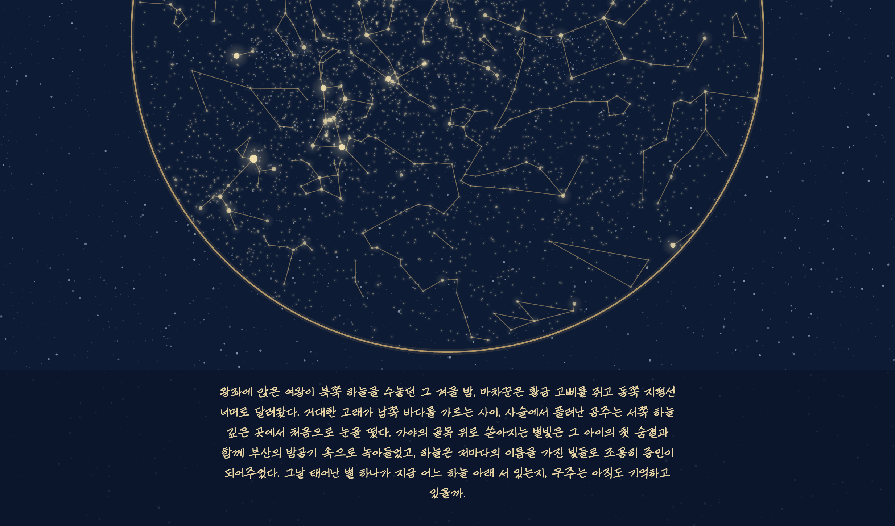

# ThatNightSky

A programmer's way of keeping a memory. Some days deserve their own sky.

Try it: [thatnightsky.tae0y.net](https://thatnightsky.tae0y.net/)

## Getting Started

1. Get the code, and run it.
    ```shell
    uv run streamlit run src/thatnightsky/app.py
    ```

1. Enter Korean address, date/time, and its meaning.

1. In a few seconds, your `That-Night-Sky` is ready.

    

    > To deploy the app with your own, see [docs/README.md](docs/README.md) — Docker, Cloudflare Tunnel, and Streamlit Cloud are covered.

## How It Works

Enter a Korean address and a date/time. The app resolves coordinates via the vworld geocoding API, computes celestial positions using [skyfield](https://rhodesmill.org/skyfield/), and renders a star chart. A short poetic narrative is generated by Claude.

The chart uses a stereographic all-sky projection: the center is the zenith (directly overhead), and the arc at the bottom edge is the horizon. Stars below the horizon are not shown.

The star-chart rendering approach is adapted from:
[Medium — I Made a Sky Map in Python. Here's How.](https://viyaleta.medium.com/how-to-make-a-sky-map-in-python-a362bf722bb2)

## Background Story

Two years ago, I heard a story about a couple who traveled to Hawaii. On their last day, they visited an observatory and stepped into the planetarium. The guide asked the wife for her birthday, then adjusted the dome and said:

*"What you see above you is the sky your father looked up at the night you were born."*

That story stayed with me. I made the first commit that same day.

Then, a long time later, on the way back from visiting my father's grave, I found myself wanting to see the night sky from the night he passed. And I wanted to build this app properly — for real, this time.

