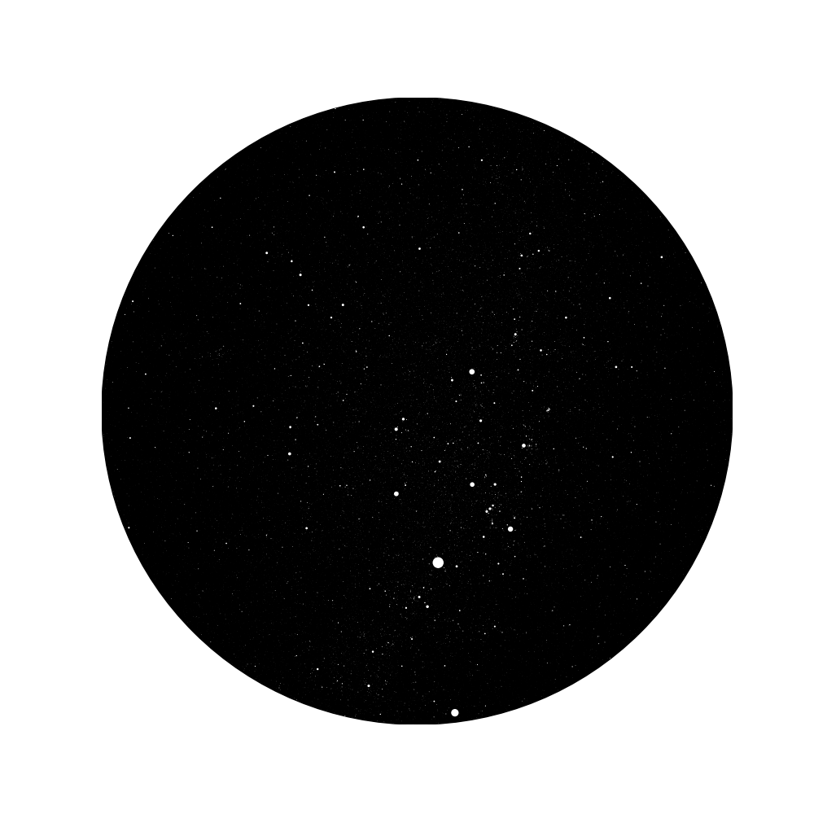

# ThatNightSky
> A programmer's way of remembering my father

## How It Works

Enter a Korean address and a date/time. The app resolves coordinates via the vworld geocoding API, computes celestial positions using [skyfield](https://rhodesmill.org/skyfield/), and renders an interactive star chart. A short poetic narrative is generated by Claude.

The star-chart rendering approach is adapted from:
[Medium — I Made a Sky Map in Python. Here's How.](https://viyaleta.medium.com/how-to-make-a-sky-map-in-python-a362bf722bb2)

## Run

```shell
uv run streamlit run app.py
```

## Samples

The northern sky on the night I was born:


The northern sky over Seoul on a late-night commit:


## Background Story

Two years ago, I heard a story about a couple visiting Hawaii. On their last day, they stopped by an observatory and stepped into the planetarium. The guide asked for the wife's birthday, adjusted the dome, and said:

*"What you're looking at is the sky your father saw the night you were born."*

That story stayed with me. I built a Python script that takes a date and location and renders the night sky for that moment — using NASA's JPL ephemeris (`de421.bsp`) and the Hipparcos star catalogue to compute star positions.

Years later, on the drive back from visiting my father's grave, I found myself wanting to see the night sky on the anniversary of his passing. And I wanted to build it properly.

Try it here: [link]