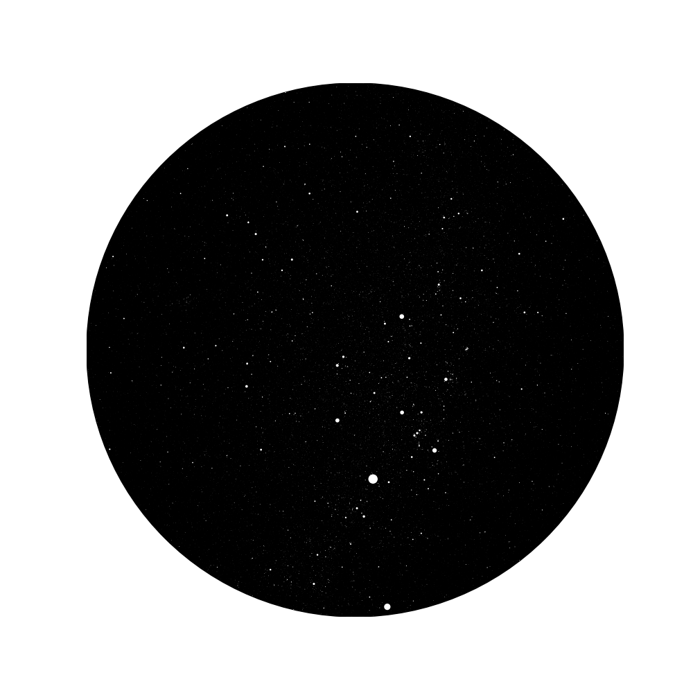

# ThatNightSky
> 내가 태어난 날 밤, 그 밤 하늘

별자리 그리는 소스는 아래 미디엄 블로그에서 복사했고  
맥, 파이썬 3.12 환경에 맞춰 일부 수정했습니다.
[Medium|I Made a Sky Map in Python. Here’s How.](https://viyaleta.medium.com/how-to-make-a-sky-map-in-python-a362bf722bb2)

`startchart.py` 파일에서 날짜, 장소를 입력한다.
```python
where = '부산광역시 가야동'
when = '1995-01-15 00:00'
```

다음 코드를 실행한다.
```shell
python starchart.py
```
  
내가 태어난 날 밤, 북쪽 밤하늘의 모습이 나온다.

  
코드를 커밋한, 야근 날 서울 북쪽 밤하늘의 모습은 이렇다.

